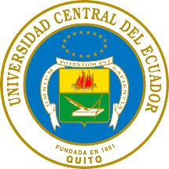

  <h1>Seminario-Taller: Fundamentos Computacionales y Cuantitativos para la Enseñanza y Validación Experimental</h1>
  <h1>Universidad Central del Ecuador</h1>
    
  <h2>Facultad de Ciencias Químicas</h2>

 

    

---

## Datos Informativos

**Nombre del evento:** [Fundamentos Computacionales y Cuantitativos para la Enseñanza y Validación Experimental](https://github.com/f0xpl0it/Seminario-Taller-Fundamentos-Computacionales-y-Cuantitativos-para-Ensenanza-Validacion-Experimental)  
**Unidad Proponente:** Facultad de Ciencias Quimicas  
**Responsable del evento:** Dr. Carlos Julio Mayorga Arias  
**Beneficiarios:** Docentes y técnicos docentes de la Institución  
**Fechas:** Por definir

---

## Descripción del Evento

El análisis computacional y cuantitativo se ha convertido en una herramienta esencial para la enseñanza, la investigación y la toma de decisiones basadas en datos. Este seminario-taller tiene como objetivo capacitar a los participantes en el uso de herramientas modernas como Python y Google Colab, aplicadas al análisis de datos, visualización, validación experimental y modelación estadística.
Se enfatizarán tanto los fundamentos teóricos como las buenas prácticas de implementación en entornos de programación interactivos.

---

## Objetivos del Seminario

### **Objetivo General**

- Desarrollar competencias para implementar análisis cuantitativos y modelación computacional mediante Python y Google Colab, con énfasis en la validación de datos y la aplicación de técnicas estadísticas básicas.
---
### **Objetivos Específicos**

<ol>
  <li>&nbsp;&nbsp;&nbsp;&nbsp;Familiarizarse con el entorno de trabajo en Google Colab y las principales bibliotecas de Python para análisis de datos</li>
  <li>&nbsp;&nbsp;&nbsp;&nbsp;Aplicar buenas prácticas de codificación y estructuración de notebooks para investigación y enseñanza.</li>
  <li>&nbsp;&nbsp;&nbsp;&nbsp;Implementar análisis estadísticos básicos como regresión lineal, pruebas de hipótesis y técnicas de visualización de datos</li>
  <li>&nbsp;&nbsp;&nbsp;&nbsp;Explorar el uso de herramientas computacionales en la validación experimental y el tratamiento de datos reales.</li>
</ol>

---

## Programa Académico

  <table border="1" cellspacing="0" cellpadding="6">
    <tr>
      <th>Día</th>
      <th>Hora</th>
      <th>Tema</th>
      <th>Facilitador</th>
    </tr>
    <!-- 8 de septiembre -->
    <tr>
      <td rowspan="2">- de septiembre Presencial</td>
      <td>Por Definir</td>
      <td colspan="2" align="center"><strong>Asistencia y Acto Inaugural</strong></td>
    </tr>
    <tr>
      <td>Por Definir</td>
      <td>
        Fundamentos de Python 
        &nbsp;&nbsp;&nbsp;• Manejo de Archivos en Colab 
        &nbsp;&nbsp;&nbsp;• Librerías Fundamentales para Análisis 
        &nbsp;&nbsp;&nbsp;• Análisis Estadístico y Numérico 
        &nbsp;&nbsp;&nbsp;• Conceptos Clave y Buenas Prácticas
      </td>
      <td rowspan="4" align="center" valign="middle">Dr. Carlos Julio Mayorga Arias</td>
    </tr>
    <!-- 9 de septiembre -->
    <tr>
      <td>- de septiembre Presencial</td>
      <td>Por Definir</td>
      <td>
        Epistemología de la Investigación Cuantitativa 
        &nbsp;&nbsp;&nbsp;• Confiabilidad y validez 
        &nbsp;&nbsp;&nbsp;• Identificación de variables 
        &nbsp;&nbsp;&nbsp;• Alcances
      </td>
    </tr>
    <!-- 10 de septiembre -->
    <tr>
      <td>- de septiembre Presencial</td>
      <td>Por Definir</td>
      <td>
        Tipos de investigación cuantitativa 
        &nbsp;&nbsp;&nbsp;• Experimental 
        &nbsp;&nbsp;&nbsp;• Cuasi experimental 
        &nbsp;&nbsp;&nbsp;• Ejemplos prácticos
      </td>
    </tr>
    <!-- 11 de septiembre -->
    <tr>
      <td>- de septiembre Virtual</td>
      <td>Por Definir</td>
      <td>
        Tipos de análisis cuantitativo aplicado 
        &nbsp;&nbsp;&nbsp;• Investigación Cuasi-experimental 
        &nbsp;&nbsp;&nbsp;• Análisis Multivariado (PCA) 
        &nbsp;&nbsp;&nbsp;• Análisis Estadístico con ANOVA y Tukey 
        &nbsp;&nbsp;&nbsp;• Fisicoquímica y Cinética Química
      </td>
    </tr>
  </table>

---

## **Recursos Taller**

  <table border="1" cellspacing="0" cellpadding="6" width="100%">
    <tr>
      <th width="10%">Día</th>
      <th width="8%">Hora</th>
      <th width="22%">Bloque Académico</th>
      <th>Tema</th>
      <th width="210px">Recursos</th>
    </tr>
    <!-- 10 de septiembre - Facultad Ciencias Químicas (va primero) -->
    <tr>
      <td>Por Definir Por Definir</td>
      <td>Por Definir</td>
      <td>Aplicaciones de Python y Google Colab</td>
      <td>
        Fundamentos de Python 
        &nbsp;&nbsp;&nbsp;• Manejo de Archivos en Colab 
        &nbsp;&nbsp;&nbsp;• Librerías Fundamentales para Análisis 
        &nbsp;&nbsp;&nbsp;• Análisis Estadístico y Numérico 
        &nbsp;&nbsp;&nbsp;• Conceptos Clave y Buenas Prácticas
      </td>
      <td>
        •  
                • <a href="https://github.com/f0xpl0it/Seminario-Taller-Fundamentos-Computacionales-y-Cuantitativos-para-Ensenanza-Validacion-Experimental/blob/main/Scripts%20Ejercicios/1_Ejercicios_de_Evaluaci%C3%B3n.ipynb">Cuaderno de Trabajo</a> 
      </td>
    </tr>
    <!-- 10 de septiembre - Evento general -->
    <tr>
      <td>- de septiembre Presencial</td>
      <td>10h30 a 13h30</td>
      <td>Fundamentos Cuantitativos y Epistemológicos para la Validación Experimental</td>
      <td>
        Epistemología de la Investigación Cuantitativa 
        &nbsp;&nbsp;&nbsp;• Confiabilidad y validez 
        &nbsp;&nbsp;&nbsp;• Identificación de variables 
        &nbsp;&nbsp;&nbsp;• Alcances
      </td>
      <td>
        • <a href="https://github.com/f0xpl0it/Seminario-Taller-Fundamentos-Computacionales-y-Cuantitativos-para-Ensenanza-Validacion-Experimental/blob/main/Jupyter%20Notebook/2_Fundamentos_Cuantitativos_Epistemol%C3%B3gicos_%20Validaci%C3%B3n_Experimental_%20Ciencia_%20Ingenier%C3%ADa.ipynb">Jupyter Notebook</a> 
        • <a href="https://github.com/f0xpl0it/Seminario-Taller-Fundamentos-Computacionales-y-Cuantitativos-para-Ensenanza-Validacion-Experimental/blob/main/Scripts%20Ejercicios/2_Ejercicios_de_Evaluaci%C3%B3n.ipynb">Cuaderno de Trabajo</a> 
        • <a href="https://github.com/f0xpl0it/Seminario-Taller-Fundamentos-Computacionales-y-Cuantitativos-para-Ensenanza-Validacion-Experimental/tree/main/Scripts%20Ejemplos"><em>Scripts (compartidos)</em></a> 
        • <a href="https://www.amarun.org/images/amarun/materiales/tesis-doctorales/2024_Mayorga_Carlos.pdf">Tesis - Carlos Mayorga</a>
      </td>
    </tr>
    <!-- 11 de septiembre - Evento general -->
    <tr>
      <td>- de septiembre Virtual</td>
      <td>Por Definir</td>
      <td>Herramientas Cuantitativas Exploratorias para el Análisis y Modelado</td>
      <td>
        Tipos de investigación cuantitativa 
        &nbsp;&nbsp;&nbsp;• Experimental 
        &nbsp;&nbsp;&nbsp;• Cuasi experimental 
        &nbsp;&nbsp;&nbsp;• Ejemplos prácticos
      </td>
      <td>
        • <a href="https://github.com/f0xpl0it/Seminario-Taller-Fundamentos-Computacionales-y-Cuantitativos-para-Ensenanza-Validacion-Experimental/blob/main/Jupyter%20Notebook/3_Herramienta_%20Cuantitativas_Exploratorias_An%C3%A1lisis_Modelado_Ciencia_Ingenier%C3%ADa.ipynb">Jupyter Notebook</a> 
        • <a href="https://github.com/f0xpl0it/Seminario-Taller-Fundamentos-Computacionales-y-Cuantitativos-para-Ensenanza-Validacion-Experimental/blob/main/Scripts%20Ejercicios/3_Ejercicios_de_Evaluaci%C3%B3n.ipynb">Cuaderno de Trabajo</a> 
        • <a href="https://www.kaggle.com/datasets/nsaravana/malware-detection">Malware-Detection</a> 
        • <a href="https://github.com/f0xpl0it/Seminario-Taller-Fundamentos-Computacionales-y-Cuantitativos-para-Ensenanza-Validacion-Experimental/tree/main/Scripts%20Ejemplos"><em>Scripts (compartidos)</em></a> 
        • <a href="https://www.amarun.org/images/amarun/materiales/tesis-doctorales/2024_Mayorga_Carlos.pdf">Tesis - Carlos Mayorga</a>
      </td>
    </tr>
    <!-- 11 de septiembre - Facultad Ciencias Químicas -->
    <tr>
      <td>Por Definir Por Definir</td>
      <td>Por Definir</td>
      <td>Aplicaciones de Python en Química y Bioquímica</td>
      <td>
        Tipos de análisis cuantitativo aplicado 
        &nbsp;&nbsp;&nbsp;• Investigación Cuasi-experimental 
        &nbsp;&nbsp;&nbsp;• Análisis Multivariado (PCA) 
        &nbsp;&nbsp;&nbsp;• Análisis Estadístico con ANOVA y Tukey 
        &nbsp;&nbsp;&nbsp;• Fisicoquímica y Cinética Química
      </td>
      <td>
        • <a href="https://github.com/f0xpl0it/Seminario-Taller-Fundamentos-Computacionales-y-Cuantitativos-para-Ensenanza-Validacion-Experimental/blob/main/Jupyter%20Notebook/4_Aplicaciones_de_Python_Qu%C3%ADmica_Bioqu%C3%ADmica.ipynb">Jupyter Notebook</a> 
        • <a href="https://github.com/f0xpl0it/Seminario-Taller-Fundamentos-Computacionales-y-Cuantitativos-para-Ensenanza-Validacion-Experimental/blob/main/Scripts%20Ejercicios/4_Ejercicios_de_Evaluaci%C3%B3n.ipynb">Cuaderno de Trabajo</a> 
      </td>
    </tr>
  </table>

                                                
---

## Referencias

<ol>
  <li>Alvarez-Rodriguez, U., Sanz, M., Lamata, L., & Solano, E. (2017). Advanced-Retarded Differential Equations in Quantum Photonic Systems. <i>Scientific Reports, 7</i>, 42933. <a href="https://doi.org/10.1038/srep42933">https://doi.org/10.1038/srep42933</a></li>

  <li>Arute, F., Arya, K., Babbush, R., Bacon, D., Bardin, J. C., Barends, R., Biswas, R., Boixo, S., Brandao, F. G. S. L., Buell, D. A., Burkett, B., Chen, Y., Chen, Z., Chiaro, B., Collins, R., Courtney, W., Dunsworth, A., Farhi, E., Foxen, B., … Martinis, J. M. (2019). Quantum supremacy using a programmable superconducting processor. <i>Nature, 574</i>(7779), 505–510. <a href="https://doi.org/10.1038/s41586-019-1666-5">https://doi.org/10.1038/s41586-019-1666-5</a></li>

  <li>Bharadwaj, S. S., & Sreenivasan, K. R. (2025). Compact quantum algorithms for time-dependent differential equations. <i>Physical Review Research, 7</i>, 023262. <a href="https://doi.org/10.1103/PhysRevResearch.7.023262">https://doi.org/10.1103/PhysRevResearch.7.023262</a></li>

  <li>Castro, M. Á., Mayorga, C. J., Sirvent, A., & Rodríguez, F. (2020). Exact numerical solutions and high order nonstandard difference schemes for a second order delay differential equation. <i>Mathematical Methods in the Applied Sciences</i>. <a href="https://doi.org/10.1002/mma.9540">https://doi.org/10.1002/mma.9540</a></li>

  <li>Creswell, J. W. (2014). <i>Research design: Qualitative, quantitative, and mixed methods approaches</i> (4th ed.). SAGE Publications.</li>

  <li>Downey, A. (2015). <i>Think stats: Exploratory data analysis in Python</i> (2nd ed.). O’Reilly Media.</li>

  <li>Field, A. (2013). <i>Discovering statistics using IBM SPSS Statistics</i> (4th ed.). SAGE Publications.</li>

  <li>Harris, C. R., Millman, K. J., van der Walt, S. J., Gommers, R., Virtanen, P., Cournapeau, D., ... & Oliphant, T. E. (2020). Array programming with NumPy. <i>Nature, 585</i>(7825), 357–362. <a href="https://doi.org/10.1038/s41586-020-2649-2">https://doi.org/10.1038/s41586-020-2649-2</a></li>

  <li>Hernández Sampieri, R., Fernández Collado, C., & Baptista Lucio, P. (2014). <i>Metodología de la investigación</i> (6.ª ed.). McGraw-Hill.</li>

  <li>Hill, D. R. C., Antunes, B. A., Cluzel, T., & Mazel, C. (2023). A few words about quantum computing, epistemology, repeatability and reproducibility. <i>HAL Open Science</i>, hal-04089148v1.</li>

  <li>Jolliffe, I. T., & Cadima, J. (2016). Principal component analysis: A review and recent developments. <i>Philosophical Transactions of the Royal Society A: Mathematical, Physical and Engineering Sciences, 374</i>(2065), 20150202. <a href="https://doi.org/10.1098/rsta.2015.0202">https://doi.org/10.1098/rsta.2015.0202</a></li>

  <li>Mayorga, C. J. (2024). Soluciones numéricas exactas y esquemas en diferencias finitas no estándar para ecuaciones diferenciales con retardo. <i>Tesis doctoral, Universidad de Alicante</i>. Recuperado de <a href="https://www.amarun.org/images/amarun/materiales/tesis-doctorales/2024_Mayorga_Carlos.pdf">https://www.amarun.org/images/amarun/materiales/tesis-doctorales/2024_Mayorga_Carlos.pdf</a></li>

  <li>Mayorga, C. J., Castro, M. Á., Sirvent, A., & Rodríguez, F. (2021). On the Construction of Exact Numerical Schemes for Linear Delay Models. <i>Mathematics, 11</i>(8), 1836. <a href="https://doi.org/10.3390/math11081836">https://doi.org/10.3390/math11081836</a></li>

  <li>McKinney, W. (2018). <i>Python for data analysis: Data wrangling with pandas, NumPy, and IPython</i> (2nd ed.). O’Reilly Media.</li>

  <li>Molero, J. M. (2020). <i>Introducción a la programación científica con Python</i>. UNED Editorial.</li>

  <li>Montgomery, D. C. (2017). <i>Design and analysis of experiments</i> (9th ed.). John Wiley & Sons.</li>

  <li>Nithya, D., Madhusudanan, V., Murthy, B. S. N., Geetha, R., Mung, N. X., Dao, N.-N., & Cho, S. (2024). Delayed dynamics analysis of SEI2RS malware propagation models in cyber–physical systems. <i>Computer Networks, 248</i>, 110481. <a href="https://doi.org/10.1016/j.comnet.2024.110481">https://doi.org/10.1016/j.comnet.2024.110481</a></li>

  <li>Oliphant, T. E. (2015). <i>A guide to NumPy</i> (2nd ed.). Continuum Analytics.</li>

  <li>Paudel, H. P., Syamlal, M., Crawford, S. E., Lee, Y.-L., Shugayev, R. A., Lu, P., Ohodnicki, P. R., & Mollot, D. (2022). Quantum Computing and Simulations for Energy Applications: Review and Perspective. <i>ACS Engineering Au, 2</i>(3), 151–196. <a href="https://doi.org/10.1021/acsengineeringau.1c00033">https://doi.org/10.1021/acsengineeringau.1c00033</a></li>

  <li>Raschka, S., & Mirjalili, V. (2019). <i>Python machine learning</i> (3rd ed.). Packt Publishing.</li>

  <li>Schork, J. (2020). Datasets for PCA (Free CSV Download) | Synthetic & Real Data. <i>Statistics Globe</i>. Recuperado de <a href="https://statisticsglobe.com/datasets-for-pca">https://statisticsglobe.com/datasets-for-pca</a></li>

  <li>Seaborn Documentation. (2024). <i>Statistical data visualization with Seaborn</i>. Recuperado de <a href="https://seaborn.pydata.org/">https://seaborn.pydata.org/</a></li>

  <li>Sweigart, A. (2015). <i>Automate the boring stuff with Python: Practical programming for total beginners</i>. No Starch Press.</li>

  <li>Tong, Y. (2025). Qubit-Efficient Quantum Algorithm for Linear Differential Equations. <i>arXiv preprint arXiv:2507.16995</i>.</li>

  <li>Tukey, J. W. (1977). <i>Exploratory data analysis</i>. Addison-Wesley.</li>

  <li>VanderPlas, J. (2016). <i>Python data science handbook: Essential tools for working with data</i>. O’Reilly Media.</li>

  <li>Virtanen, P., Gommers, R., Oliphant, T. E., Haberland, M., Reddy, T., Cournapeau, D., ... & SciPy Contributors. (2020). SciPy 1.0: Fundamental algorithms for scientific computing in Python. <i>Nature Methods, 17</i>(3), 261–272. <a href="https://doi.org/10.1038/s41592-019-0686-2">https://doi.org/10.1038/s41592-019-0686-2</a></li>

  <li>Zavala, R. J. (2019). Fundamentos epistémicos de la investigación cualitativa y cuantitativa. <i>Revista Científica de Ciencias de la Salud, 22</i>(1), 75–80. <a href="https://www.scielo.org.pe/scielo.php?script=sci_arttext&pid=S2223-25162019000100008">https://www.scielo.org.pe/scielo.php?script=sci_arttext&pid=S2223-25162019000100008</a></li>

  <li>Zhang, W., Yang, X., & Yang, L. (2025). A Delayed Malware Propagation Model Under a Distributed Patching Mechanism: Stability Analysis. <i>Mathematics, 13</i>(14), 2266. <a href="https://doi.org/10.3390/math13142266">https://doi.org/10.3390/math13142266</a></li>
</ol>

---

## Licencia

Este seminario-taller está organizado por la Universidad Central del Ecuador y se encuentra bajo la Licencia [MIT](https://github.com/Zexc4/Investigacion-Cuantitativa-FCQ/blob/main/LICENSE).

Esto significa que:

- Se permite el uso, copia, modificación, fusión, publicación, distribución, sublicencia y/o venta del contenido.
- El contenido puede ser reutilizado en proyectos personales, académicos o comerciales.
- No se imponen restricciones significativas siempre que se incluya la nota de copyright y la licencia original en cualquier copia sustancial del contenido.

**Importante:** Este material se proporciona “tal cual”, sin garantía de ningún tipo, expresa o implícita.

Para más detalles, puedes consultar la licencia completa en: [https://opensource.org/licenses/MIT](https://opensource.org/licenses/MIT)

---
## Contacto

**Dr. Carlos Julio Mayorga Arias**  
Facultad de Ciencias Químicas, Universidad Central del Ecuador  

 

    
    
    

